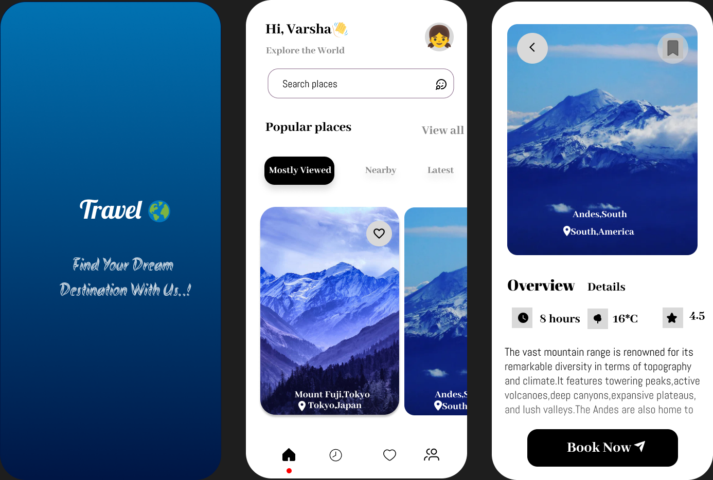

# Mobile Travel Application – UI/UX Design

## Project Description
Designed a mobile travel application home screen focusing on intuitive UI/UX principles and user-centric design. Prioritized clear information hierarchy, seamless navigation, and accessibility to enhance usability. Applied modern design standards, visual consistency, and interactive elements to deliver an engaging and visually appealing user experience.

## Tools Used
- Figma

## Design Preview

